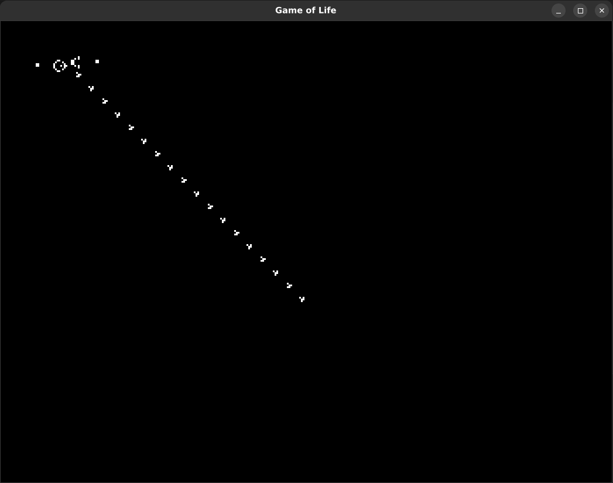

# Game of Life

Experiment to explore mutability and lifetime in Rust.

Conway's Game of Life is a zero-player game, meaning its evolution is determined by its initial state, requiring no further input. The game simulates the lives of cells on a grid where each cell can either be alive or dead. The state of each cell changes in each iteration based on the number of live neighbors it has.

